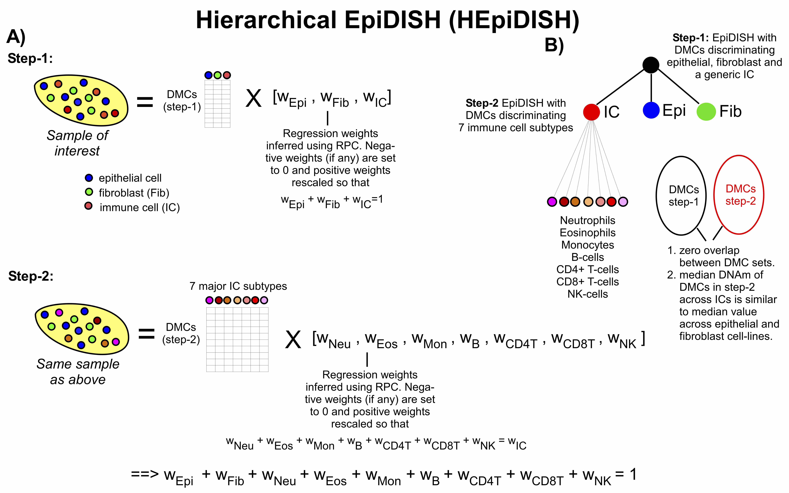
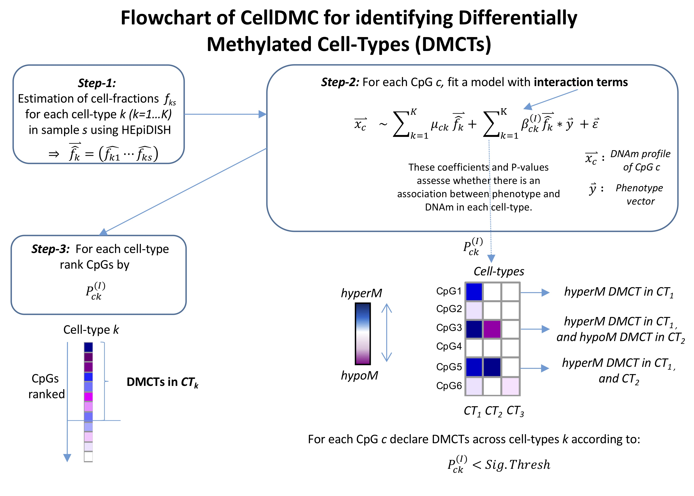

# Introduction

The **EpiDISH** package provides tools to infer the fractions of a priori known cell subtypes present in a sample representing a mixture of such cell-types. Inference proceeds via one of 3 methods (Robust Partial Correlations-RPC[@EpiDISH], Cibersort-CBS[@CBS], Constrained Projection-CP[@CP]), as determined by the user. Besides, we also provide a function - CellDMC which allows the identification of differentially methylated cell-types in Epigenome-Wide Association Studies(EWAS)[@CellDMC].

For now, the package contains 4 references, including two whole blood subtypes reference, one generic epithelial reference with epithelial cells, fibroblasts, and total immune cells, and one reference for breast tissue, as described in [@EpiDISH] and [@HEpiDISH].


# How to estimte cell-type fractions using DNAm data

To show how to use our package, we constructed and stored a dummy beta value matrix *DummyBeta.m*, which contains 2000 CpGs and 10 samples, in our package.

We first load **EpiDISH** package, *DummyBeta.m* and the EpiFibIC reference.
```{r load, eval=TRUE, echo=T, message=FALSE, warning=FALSE}
library(EpiDISH)
data(centEpiFibIC.m)
data(DummyBeta.m)
```

Notice that *centEpiFibIC.m* has 3 columns, with names of the columns as EPi, Fib and IC. We go ahead and use *epidish* function with *RPC* mode to infer the cell-type fractions.
```{r infer, eval=TRUE, echo=T, message=FALSE, warning=FALSE}
out.l <- epidish(beta.m = DummyBeta.m, ref.m = centEpiFibIC.m, method = "RPC") 
```

Then, we check the output list. *estF* is the matrix of estimated cell-type fractions. *ref* is the reference centroid matrix used, and *dataREF* is the subset of the input data matrix over the probes defined in the reference matrix.
```{r check, eval=TRUE, echo=T, message=FALSE, warning=FALSE}
out.l$estF
dim(out.l$ref)
dim(out.l$dataREF)
```

In quality control step of DNAm data preprocessing, we might remove bad probes from all probes on 450k or 850k array; consequently, not all probes in the reference could be found in the given dataset. By checking *ref* and *dataREF*, we can extract the probes actually used to biuld the model and infer the cell-type fractions. If the majority of the probes in the reference cannot be found, the estimated fractionss might be compromised.

And now we show an example of using our package to estimate cell-type fractions of whole blood tissues. We use a subset beta value matrix of GSE42861 (detailed description in manaul page of *LiuDataSub.m*).

```{r inferBlood, eval=TRUE, echo=T, message=FALSE, warning=FALSE}
data(LiuDataSub.m)
BloodFrac.m <- epidish(beta.m = LiuDataSub.m, ref.m = centDHSbloodDMC.m, method = "RPC")$estF
```

We can easily check the inferred fractions with boxplots. From the boxplots, we observe that just as we expected, the major cell-type in whole blood is neutrophil.
```{r boxplot, eval=TRUE, echo=T, message=FALSE, warning=FALSE, fig.height = 5, fig.width = 8, fig.align = "center"}
boxplot(BloodFrac.m)
```


# How to estimte cell-type fractions in the two-step framework
HEpiDISH is an iterative hierarchical procedure of EpiDISH. HEpiDISH uses two distinct DNAm references, a primary reference for the estimation of fractions of several cell-types and a separate secondary non-overlapping DNAm reference for the estimation of underlying subtype fractions of one of the cell-type in the primary reference.
 
In this example, the third cell-type in primary reference is total immune cell. We would like to know the fractions of immune cell subtypes. So we use a secondary reference, which contains 7 immnue cell subtypes, and let **hepidish** function know that the third column of primary reference should correspond to the secodnary reference. (We only include 3 cell-types of the *centBloodSub.m* reference because we mixed those three cell-types to generate the dummy beta value matrix.)
```{r hepidish, eval=TRUE, echo=T, message=FALSE, warning=FALSE}
data(centBloodSub.m)
frac.m <- hepidish(beta.m = DummyBeta.m, ref1.m = centEpiFibIC.m, ref2.m = centBloodSub.m[,c(1, 2, 5)], h.CT.idx = 3, method = 'RPC')
frac.m
```


# More info about different methods for cell-type fractions estimation
We compared CP and RPC in [@EpiDISH]. And we also published a review article[@review] which discusses most of algorithms for tackling cell heterogeneity in Epigenome-Wide Association Studies(EWAS). Refer to references section for more details.


# How to identify differentially methylated cell-types in EWAS
After estimating cell-type fractions, we can then identify differentially methylated cell-types and their directions of change using **CellDMC** [@CellDMC]function. The workflow of **CellDMC** is shown below.



We use a binary phenotype vector here, with half of them representing controls and other half representing cases.
```{r celldmc, eval=TRUE, echo=T, message=FALSE, warning=FALSE}
pheno.v <- rep(c(0, 1), each = 5)
celldmc.o <- CellDMC(DummyBeta.m, pheno.v, frac.m)
```

The DMCTs prediction is given(pls note this is faked data. The sample size is too small to find DMCTs.):
```{r dmct, eval=TRUE, echo=T, message=FALSE, warning=FALSE}
head(celldmc.o$dmct)
```
The estimated coefficients for each cell-type are given in the *celldmc.o$coe*.
Pls refer to help page of **CellDMC** for more info.


# Sessioninfo

```{r sessionInfo, echo=FALSE}
sessionInfo()
```

# References


